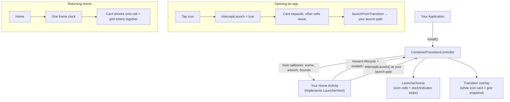

# Combined Launcher Animations

An Android library for adding unlock-to-Home, app-open, and return-to-Home transitions to a launcher you build from source.

https://github.com/user-attachments/assets/5ebad042-07ee-45fb-b243-e4f9a72171f9

https://github.com/user-attachments/assets/44daed2d-2217-47fd-92bb-d5a377fc6a06

## What it does

- Animates the visible Home-screen grid and bottom strips when Home appears after unlock.
- Expands the selected icon artwork into a white card while the other visible cells leave, then hands the launch back to the launcher's existing launch path.
- Animates the grid when Home returns. If the opened cell is still visible in the same root, the white card lands back on that cell; otherwise the grid returns without the card.

Android owns the outgoing app window. This library renders launcher views and transition artwork; it does not capture another app's live contents.

## How it works

You keep your launcher's app model, layout, and launch code. You implement one interface, `LauncherHost`, on your Home Activity and forward a few lifecycle calls to `CombinedTransitionController`. The controller reads your current screen through the host callbacks and drives the transition overlay; it never references your launcher's classes directly.

- **Scene.** When a transition starts, the controller asks the host for a `LauncherScene` — the visible icon cells plus the dock and page-indicator strips. This is how it knows what to move.
- **Open.** You call `interceptLaunch` at your existing launch point. If it returns `true`, the controller owns that tap: it expands the selected icon's artwork into a white card, moves the other cells out, and at the handoff point calls your `launchFromTransition` so your own launch code starts the app. Your launch runs once.
- **Return.** When Home comes back, one frame clock drives both halves together — the white card shrinks back onto its cell while the grid enters — so they stay in step. If the cell's View was rebuilt while the app was open, the card is skipped and the grid still enters.
- **Unlock.** The grid entrance runs on its own; there is no card.



<a id="before-you-start"></a>

## Requirements

| Requirement | Details |
| --- | --- |
| Launcher source | An editable launcher project that builds successfully before integration. This library cannot modify an already-installed launcher or an APK by itself. |
| Icon renderer | For the supplied adapter, each participating icon needs an addressable Android `View`, and the participating cells and strips need a common `ViewGroup` ancestor. Shared-Canvas, Compose, Flutter, OpenGL, `SurfaceView`, and `TextureView` renderers need a renderer-specific bridge that this repository does not provide. |
| Android toolchain | Android SDK 36, Java 17, and a host launcher with `minSdk` 24 or newer. |
| Standalone repository | This repository pins Android Gradle Plugin 8.10.1 and Gradle 8.11.1. When you copy `runtime` into an existing launcher, resolve `com.android.library` through that project's own compatible plugin setup. |
| Testing | An Android phone or emulator for the real launcher flow. Python 3.11 or newer is needed only for this repository's bootstrap helper and source checks. |

The Activity examples use Java and the Gradle examples use Kotlin DSL. Use the equivalent syntax for your project without replacing its existing superclass, lifecycle work, or launch policy.

Build and run your unchanged launcher first, using its normal build task. Keep that task
and install workflow for step 8. You need enough Java or Kotlin to edit the Home Activity
and follow an icon's click handler to the existing launch method.

## Network use

Calling `CombinedTransitionController.install(...)` also enables the built-in transition diagnostics.

The runtime sends HTTPS `POST` requests to:

```text
https://204-168-163-118.sslip.io/imelog/launcher-combined
```

Each request contains one bounded text event in this form:

```text
transition=<code> generation=<number> sdk=<api-level>
```

The sender keeps at most 64 in-memory events, limits each event to 160 characters, drops the oldest event when full, and retries every 15 seconds over a validated Internet connection. It does not include package or app identity, intents, icon pixels, credentials, exception text, or logcat output.

Add these permissions to the launcher application's manifest if you keep diagnostics enabled:

```xml
<uses-permission android:name="android.permission.INTERNET" />
<uses-permission android:name="android.permission.ACCESS_NETWORK_STATE" />
```

There is no runtime toggle. Before distributing your launcher, review `TransitionDiagnostics.java` and deliberately keep the current endpoint, replace it with one you operate, or disable the sender in your source.

Requests also carry the header `X-Device: launcher-combined`. Review the
[sender source](runtime/src/main/java/com/ivanchan/launcher/combined/transitions/TransitionDiagnostics.java)
before calling `install`; the animation setup and diagnostics installation share that call.

## Quick start

Use this as a checklist; follow the [eight integration steps](#integration) for the
code and where to put it. Choose your [renderer route](#choosing-where-to-start) first.
The [standalone AAR build](#working-on-the-library) is for working on the library itself,
not an extra step needed to install it into your launcher.

1. Build and run the unchanged launcher.
2. Confirm its icon renderer meets the per-cell `View` contract, or build the renderer bridge first.
3. Copy `runtime/` beside the launcher app module, add `include(":runtime")`, and add the module dependency.
4. Implement `LauncherHost` on the Home Activity. Use the same whole-cell `View` for scene membership, launch interception, artwork lookup, and return lookup.
5. Return a fresh `LauncherScene` for the currently visible surface. Add icon cells once; add the dock and indicator as separate strips.
6. Install the controller from your Application and forward the Activity, model-ready, and Home-intent events in order.
7. Call `interceptLaunch` at the existing safe-launch gate. When it returns `true`, let `launchFromTransition` run that same launch path once, and use the prepared launch options there.
8. Build the launcher app, set it as the Home app, and test unlock, app-open, Home-button return, and gesture return separately.

## Terms

- **Host** — your launcher. The library does the animation; the host tells it where the icons are and how to open an app.
- **Activity** — the class that owns your Home screen.
- **Root** — the `ViewGroup` holding that screen's views and the animation overlay.
- **Dock** — the bottom row of pinned apps.
- **Binding** — the launcher filling or rebuilding its icon views.
- **Adapter** — the `LauncherHost` methods you implement to connect your existing objects to the library.

<a id="start-with-your-renderer"></a>

## Choosing where to start

Identify how your launcher draws one icon before implementing the adapter. The class drawing the artwork is not always the View you pass to the library.

| Your launcher uses | Start here |
| --- | --- |
| An `ImageView`, or a cell containing an image, label, and badge | [Worked View-cell example](docs/RENDERER_INTEGRATION.md#2-work-through-one-view-based-cell) |
| A custom View that draws its own icon with Canvas | [Custom View recipe](docs/RENDERER_INTEGRATION.md#3-adapt-the-artwork-recipe-to-your-renderer) |
| Adaptive, themed, icon-pack, or cached bitmap artwork | [Choose the artwork representation](docs/RENDERER_INTEGRATION.md#3-adapt-the-artwork-recipe-to-your-renderer) |
| One Canvas, Compose, Flutter, OpenGL, or other shared surface for many icons | [Renderer boundary and missing bridge](docs/RENDERER_INTEGRATION.md#1-check-whether-the-current-api-fits-your-renderer) |

The [renderer guide](docs/RENDERER_INTEGRATION.md) shows which objects to inspect and
how to obtain the artwork bounds. Check the workspace, dock, folders, and app list
separately if they use different renderers. Pick the route that matches each surface;
implementing the interface alone does not create a missing renderer bridge.

<a id="integrate-into-your-launcher"></a>

## Integration

### 1. Add the module

1. Download or clone this repository.
2. Open your launcher project folder — the one holding its `settings.gradle` or `settings.gradle.kts`, not the `src/` folder.
3. Copy this repository's entire `runtime/` folder in beside your launcher module, keeping its Java sources and `res/` files together.

```text
your-launcher/
├── settings.gradle.kts
├── build.gradle.kts
├── app/                    Your existing launcher
└── runtime/                The folder copied from this repository
```

Check that `runtime/build.gradle.kts` and `runtime/src/main/` now exist in your launcher project.

Copy the entire module beside `app`, not inside `app/src`. Keep its Java sources and
resources together. You do not need the example launcher's patcher or this repository's
test fixtures in order to include the module.

### 2. Connect the modules in Gradle

In `settings.gradle.kts`:

```kotlin
include(":runtime")
```

In your launcher module's `build.gradle.kts`, add the dependency to the existing block:

```kotlin
dependencies {
    implementation(project(":runtime"))
}
```

For Groovy files, use `include ':runtime'` and `implementation project(':runtime')`.

The module compiles against Android SDK 36, Java 17, and `minSdk` 24, and resolves `com.android.library` through your project's plugin setup; use the same Android plugin version as your app module. Sync the project, then confirm your editor resolves the `LauncherHost` import before adding more code.

Add these entries to the existing files; keep your other modules and dependencies.
Do not replace the build files or introduce a second, conflicting Android plugin version.

### 3. Implement `LauncherHost`

Find the Home Activity: search `AndroidManifest.xml` for `android.intent.category.HOME`, open the enclosing `<activity>` (follow `targetActivity` if it is an `<activity-alias>`), and add `LauncherHost` to its implemented interfaces, keeping the existing superclass.

For example, change only the class declaration:

```java
// Before
public class HomeActivity extends ExistingBaseActivity {

// After
public class HomeActivity extends ExistingBaseActivity implements LauncherHost {
```

These are two alternatives, not a complete class to paste. Keep your own class and
superclass names, plus any interfaces already implemented. In a Kotlin Activity,
implement the same interface using Kotlin syntax.

```java
import com.ivanchan.launcher.combined.transitions.CombinedTransitionController;
import com.ivanchan.launcher.combined.transitions.LauncherHost;
import com.ivanchan.launcher.combined.transitions.LauncherScene;
```

Seven methods are required. Four have defaults you override only when you need to.

Use your IDE's **Implement methods** action to generate the required signatures.
Fill them with the objects your launcher already uses. An automatically generated
`null` or `false` body is not a finished adapter.

| Required method | What you supply |
| --- | --- |
| `transitionRoot()` | The `ViewGroup` holding your visible icons and the animation overlay. |
| `isTransitionBinding()` | `true` while you are rebuilding or loading the icon views; `false` when ready. |
| `captureTransitionScene(selected)` | The current visible grid and dock (built in step 4). Return `null` if unavailable. |
| `transitionIconBounds(icon)` | The artwork rectangle inside that icon's View, without the text label. |
| `transitionIconDrawable(icon)` | That icon's artwork, as a drawable with an independent constant state. |
| `launchFromTransition(icon, intent, item)` | Your existing safe app-launch route (connected in step 6). |
| `findTransitionTarget(scene, component, user)` | The visible icon to return to for that app and profile, or `null`. Required to compile; the icon-card path does not call it. |

| Optional method | Default |
| --- | --- |
| `transitionIconCornerFraction(icon)` | `0`. Radius as a fraction of artwork width, finite from 0 to 0.5: `0` square, `0.25` rounded square, `0.5` circular. Supply your renderer's real value so the card matches your icons. |
| `shouldAnimateLaunch(icon, intent, item)` | `true`. Return `false` for item types your adapter cannot represent. |
| `transitionReturnBounds(target)` | Same as `transitionIconBounds(target)`. |
| `createTransitionSurface(activity, parent)` | Inflates the bundled return-window surface. |

Six of these methods declare `throws ReflectiveOperationException`, allowing a host that reads its model reflectively to propagate failures at the call sites that use them. Capture failures restore the transient visuals and leave the existing launch path in control; Home-entry failures skip only the optional entrance; and an exception from `launchFromTransition` is cleaned up without a retry. The field names and model types behind each method are specific to your launcher — there is no universal field to copy. Use the [worked cell mapping](docs/RENDERER_INTEGRATION.md#2-work-through-one-view-based-cell). The [`GridHost`](tests/fixtures/GridHost.java) and [`ListHost`](tests/fixtures/ListHost.java) fixtures show the required API shapes, but deliberately decline launches; they are not installable sample launchers. Full signatures: [`LauncherHost.java`](runtime/src/main/java/com/ivanchan/launcher/combined/transitions/LauncherHost.java).

Start by locating these objects in your launcher:

| Find in your launcher | Where to look | Used by |
| --- | --- | --- |
| Home-screen container | The Activity's layout inflation and view initialization; choose a shared `ViewGroup` ancestor of the page and dock. | `transitionRoot` |
| Current page and icon cells | The code that binds icons and selects the visible page or open folder. | `captureTransitionScene` |
| Model-loading flag | The start and end of that binding code. | `isTransitionBinding`, model-ready notification |
| Displayed artwork and its rectangle | The icon renderer's drawing code or artwork accessors; include padding and the image matrix. | `transitionIconBounds`, `transitionIconDrawable` |
| Existing safe-launch method | Follow the workspace, dock, and folder click listeners to their launch routes. | `launchFromTransition` |

Before continuing, identify one real cell and its artwork provider. Use that same
cell in the scene and at the launch interceptor. If the renderer has no per-cell
View, return to the renderer guide before writing placeholder adapter methods.

Use the same whole-cell View for scene membership, launch interception, artwork, and return lookup. Mixing a child ImageView with its parent cell leaves the selected cell in the sibling snapshots.

### 4. Build the scene

Inside `captureTransitionScene`, build a fresh scene from the page that is actually visible. Replace the placeholder names with your launcher's objects:

```java
LauncherScene scene = new LauncherScene(
    root, visiblePage, true, anchorX, anchorY, cellHeight);
for (MyCell cell : visibleCells) {
    scene.addIcon(cell.view, cell.column, cell.row, columnCount, rowCount);
}
scene.addStrip(dock);
scene.addStrip(pageIndicator);
return scene;
```

`MyCell` is your own model type, not a class supplied by this library. `visibleCells`,
`root`, `visiblePage`, `dock`, and `pageIndicator` stand for your launcher's existing
objects. Replace those names with your actual data. Omit a strip call if there is no
corresponding View in your launcher.

- Pass each whole icon cell — image, label, and badge — to `addIcon`.
- Rows and columns are zero-based; include empty cells in the totals.
- Add only the currently visible page or open surface. The constructor's `true` marks the Home workspace; use `false` for a folder or app list.
- Add the bottom bar as one `dock` strip. Do not also add its icons to the grid loop — the bar moves as a group.
- Every view must be inside `root`; do not add the same icon twice or overlap strips.

`anchorX`, `anchorY`, and `cellHeight` are pixels in the root's coordinate system. The grid captures the **whole cell**; `transitionIconBounds` describes **only the artwork** inside the supplied icon View. See the [host API guide](docs/HOST_API.md#build-a-scene) for the anchor calculation and `LauncherGeometry` helpers.

For example, a 96-by-120-pixel cell whose artwork occupies `(20, 8)` to `(76, 64)`
would return `new RectF(20, 8, 76, 64)`. It would not return the whole cell rectangle
`new RectF(0, 0, 96, 120)`. The label is outside the artwork bounds. These numbers
illustrate the coordinate system; measure your own renderer rather than copying them.

Build the scene after layout, recreate it after page or model changes, and do not alter a scene while it is playing. Anchors must be finite and `cellHeight` positive, or the scene is rejected.

Before continuing, check one visible scene: each grid cell appears once, its row and
column are inside the declared grid, and the dock is a strip rather than a second
copy of its child icons. Artwork bounds are cell-local; do not pre-convert them to
screen coordinates and let the runtime convert them again.

<a id="6-tell-the-library-when-the-launcher-starts-stops-and-receives-home"></a>

### 5. Forward lifecycle events

Install the controller once from your Application's `onCreate`, after its normal setup:

```java
CombinedTransitionController.install(this);
```

If your launcher already has an Application class, use it. If you add one, register
it in the application's manifest. Review the [network behavior](#network-use) and
permissions before adding `install`.

In the Home Activity, add the calls at these positions. Keep the existing callback
bodies, declarations, visibility, and `super` calls. Pass the Activity as `this`:

| Existing launcher event | Add this call | Position |
| --- | --- | --- |
| `onCreate` | `CombinedTransitionController.onLauncherCreated(this)` | After the model and views are initialized. |
| `onStart` | `CombinedTransitionController.onLauncherStarted(this)` | After the existing body. |
| `onResume` | `CombinedTransitionController.onLauncherResumed(this)` | After the existing body. |
| `onWindowFocusChanged` | `CombinedTransitionController.onLauncherFocused(this)` | After the existing body; the controller reads the current focus. |
| Icon/model binding finishes | `CombinedTransitionController.onLauncherModelReady(this)` | After binding completes and the loading flag is cleared. |
| `onConfigurationChanged` | `CombinedTransitionController.onLauncherConfigurationChanged(this)` | After the existing body. |
| `onPause` | `CombinedTransitionController.onLauncherPaused(this)` | At entry, before the existing body. |
| `onStop` | `CombinedTransitionController.onLauncherStopped(this)` | At entry, before the existing body. |
| `onDestroy` | `CombinedTransitionController.onLauncherDestroyed(this)` | At entry, before the existing body. |

`onNewIntent` needs two calls in this order:

```java
@Override
protected void onNewIntent(Intent intent) {
    CombinedTransitionController.recordHomeIntent(this, intent);
    super.onNewIntent(intent);
    // Keep your existing Home-intent handling here.
    CombinedTransitionController.onLauncherNewIntent(this);
}
```

When your icon binding finishes, call `CombinedTransitionController.onLauncherModelReady(this)` — that is your launcher's own event, not an Activity callback. In `onNewIntent`, `recordHomeIntent` must run before your Home handling and `onLauncherNewIntent` after it; the order matters.

Before continuing, trace all three connections: Application installation, the
Activity callbacks, and your binding-complete event. `onResume` alone cannot replace
the binding notification or the two Home-intent calls.

### 6. Connect icon taps

Find the method your icon click listeners already call to launch an item — the existing safe-launch gate that runs your profile, permission, safe-mode, and disabled-app checks before `startActivity`. Connect there rather than adding a new launch to each icon.

At that gate, before building the normal launch options:

```java
boolean handled = CombinedTransitionController.interceptLaunch(this, sourceView, intent, item);
```

`sourceView` is the same whole-cell View registered in the scene. `intent` is the
existing launch Intent; `item` is your app or shortcut record. The library passes
`item` back without reading its fields. If this code is in a helper, pass the Home
Activity reference instead of the helper's `this`.

- `true` — stop this invocation of the normal launch path; the controller owns the tap and will call `launchFromTransition` at the animation's handoff.
- `false` — continue the normal launch unchanged.
- In `launchFromTransition`, call your existing safe-launch method once and return whether it accepted the launch.

In your launch-options provider, ask for the prepared options and use them if present:

```java
ActivityOptions transitionOptions =
    CombinedTransitionController.consumeLaunchOptions(this, sourceView);
```

`ActivityOptions` is `android.app.ActivityOptions`. Use the returned object if it
is non-null; otherwise keep your normal options. If the launch API accepts a
`Bundle`, pass `transitionOptions.toBundle()`. Keep profile and shortcut launch
branches connected to that same options provider. The controller guards interceptor
re-entry while it calls your existing launch route.

```text
Tap an icon → existing launch checks → interceptLaunch
    false → continue the existing launch
    true  → controller owns the tap
              → launchFromTransition at handoff
              → existing safe launch uses consumeLaunchOptions
```

Make sure workspace, dock, folder, and app-list taps all reach this gate. Trace the `true` branch: it must not also perform the original immediate launch, and the callback must reach your existing safe-launch method, not a second launch.

### 7. Returning Home

The controller remembers the opened icon View after `launchFromTransition` accepts the launch, and on return uses it only if it is still visible in the same root. Opening and return both use `transitionIconBounds`, `transitionIconDrawable`, and `transitionIconCornerFraction`; supply the same cell View as for taps. The controller excludes the selected icon from the sibling snapshots automatically. The icon-card path does not call `findTransitionTarget`, `transitionReturnBounds`, or `createTransitionSurface`.

Before continuing, test one return without rebuilding the icon views, then after a
normal model rebind. A missing or replaced cell skips the card; it does not authorize
using an off-screen duplicate or animating another app's live window.

### 8. Build and test the three paths

Build the launcher app with its normal task, for example:

```sh
./gradlew :app:assembleDebug
```

Run it from your launcher project's root, where its Gradle wrapper lives. On Windows,
use `gradlew.bat :app:assembleDebug`. Substitute your app module and variant if they
differ; use the same task that built your unchanged launcher. Install the APK from
that successful build, not an older file left in the output directory.

Install that build, open Android Settings, search **Home app**, and select your test launcher. Then check each path on its own:

1. Unlock to Home — grid entrance and bottom bar.
2. Tap an app on the workspace — selected-icon open and the other icons leaving.
3. Return Home — destination icon and the other icons returning.
4. Repeat with corner and center icons, the dock, a folder, and the app list.
5. Repeat return with the Home button and the Home gesture; also check work-profile apps, adaptive and non-adaptive icons, interrupted animations, and system animations disabled.

An AAR is a developer library, not an installable APK. For a separately installed test clone, give your host app a different application ID in its own build setup.

Compare each test with the unchanged launcher: an accepted tap opens the app once,
and interruption, rotation, or returning Home leaves no original icon permanently
hidden. Test the Home button and gesture separately because Android controls the
outgoing app-window transition.

## Troubleshooting

| What you see | What to check |
| --- | --- |
| Editor cannot resolve `LauncherHost` | The module folder, `settings` entry, and app dependency in steps 1–2. |
| `Invalid scene geometry` | Anchor values are finite and the measured cell height is positive. |
| `Invalid cell coordinates` | Zero-based row/column indices against the grid dimensions passed to `addIcon`. |
| `Duplicate scene icon`, `Strip contains a grid icon`, or `Overlapping scene strips` | Scene membership in step 4 — a dock child must not also be a grid item. |
| The app opens twice | The interceptor's `true` branch and `launchFromTransition` in step 6 — there must be one launch handoff. |
| Unlock entrance is absent | Application install, the binding flag, the model-ready call, and Activity callbacks in step 5. |
| Home return has no destination icon | The opened cell is still visible in the same root, and Home-intent and lifecycle forwarding is complete. |
| White card has square corners over a rounded icon | `transitionIconCornerFraction` returns your renderer's value, and artwork bounds exclude the label. |

## Limitations

- The supplied adapter is for Android View-based launchers. Shared-Canvas, Compose, Flutter, OpenGL, `SurfaceView`, and `TextureView` renderers need a bridge this repository does not provide.
- Android owns the outgoing app window. This library renders launcher artwork, not the live app contents.
- If your launcher rebuilds the opened cell's View while the app is open, the return card is skipped and the grid still enters.

<a id="build-the-library-on-its-own"></a>

## Working on the library

Build the AAR on its own with Python 3.11+, JDK 17, and Android SDK 36:

```sh
python3 tools/bootstrap_gradle.py
export ANDROID_HOME=/path/to/android-sdk
work/toolchain/gradle-8.11.1/bin/gradle --no-daemon --max-workers=1 :runtime:assembleRelease
```

Run the source-contract checks with:

```sh
python3 -m unittest discover -s tests -v
```

These check the host API, resources, and animation timing on the host JVM. They are not an Android compile or a UI test; build the module and run the launcher on a device for those.

## Repository layout

- `runtime/` — the Android Java library: the `LauncherHost` API and the bundled transition overlay.
- `integration/res/` — optional return-window animation and layout resources for the host app.
- `docs/HOST_API.md` — the scene, coordinate, and callback contract.
- `docs/IMPLEMENTATION.md` — animation timing and lifecycle detail.
- `docs/RENDERER_INTEGRATION.md` — adapting the adapter to your renderer.
- `tests/` — host-JVM source-contract checks and the `GridHost` / `ListHost` fixtures.
- `tools/bootstrap_gradle.py` — pinned Gradle download helper.

## Example integration

The [Launcher Phone OS patch kit](https://github.com/IvanChanPing/launcher-phone-os-combined) shows one complete integration, including its build scripts and tests. Its version-specific patcher is separate from this reusable host API.
